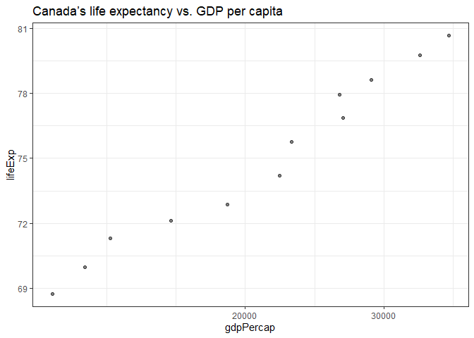

# Exercise 1: Basic dplyr
Use dplyr functions to achieve the following exercises 


```r
library(ggplot2)
library(dplyr)
```

```
## 
## Attaching package: 'dplyr'
```

```
## The following objects are masked from 'package:stats':
## 
##     filter, lag
```

```
## The following objects are masked from 'package:base':
## 
##     intersect, setdiff, setequal, union
```

```r
library(gapminder)
```

### Gapminder dataset 

```r
gapminder
```

```
## # A tibble: 1,704 x 6
##    country     continent  year lifeExp      pop gdpPercap
##    <fct>       <fct>     <int>   <dbl>    <int>     <dbl>
##  1 Afghanistan Asia       1952    28.8  8425333      779.
##  2 Afghanistan Asia       1957    30.3  9240934      821.
##  3 Afghanistan Asia       1962    32.0 10267083      853.
##  4 Afghanistan Asia       1967    34.0 11537966      836.
##  5 Afghanistan Asia       1972    36.1 13079460      740.
##  6 Afghanistan Asia       1977    38.4 14880372      786.
##  7 Afghanistan Asia       1982    39.9 12881816      978.
##  8 Afghanistan Asia       1987    40.8 13867957      852.
##  9 Afghanistan Asia       1992    41.7 16317921      649.
## 10 Afghanistan Asia       1997    41.8 22227415      635.
## # ... with 1,694 more rows
```

## 1.1
Use filter() to subset the gapminder data to three countries of your choice in the 1970’s.

```r
gapminder %>% 
  filter(year > 1969 & year < 1980 & country %in% c("Afghanistan", "Albania", "Algeria"))
```

```
## # A tibble: 6 x 6
##   country     continent  year lifeExp      pop gdpPercap
##   <fct>       <fct>     <int>   <dbl>    <int>     <dbl>
## 1 Afghanistan Asia       1972    36.1 13079460      740.
## 2 Afghanistan Asia       1977    38.4 14880372      786.
## 3 Albania     Europe     1972    67.7  2263554     3313.
## 4 Albania     Europe     1977    68.9  2509048     3533.
## 5 Algeria     Africa     1972    54.5 14760787     4183.
## 6 Algeria     Africa     1977    58.0 17152804     4910.
```

## 1.2 
Use the pipe operator %>% to select “country” and “gdpPercap” from your filtered dataset in 1.1

```r
gapminder %>% 
  filter(year > 1969 & year < 1980 & country %in% c("Afghanistan", "Albania", "Algeria")) %>% 
  select(country, gdpPercap) #the c() is superfluous 
```

```
## # A tibble: 6 x 2
##   country     gdpPercap
##   <fct>           <dbl>
## 1 Afghanistan      740.
## 2 Afghanistan      786.
## 3 Albania         3313.
## 4 Albania         3533.
## 5 Algeria         4183.
## 6 Algeria         4910.
```

## 1.3
Make a new variable in gapminder for the change in life expectancy from the previous measurement. Filter this table to show all of the entries that have experienced a drop in life expectancy.

Hint: you might find the lag() or diff() functions useful.


```r
gapminder %>% 
  group_by(country) %>%  
  mutate(delta_lifeExp = lifeExp - lag(lifeExp)) %>% 
  filter(delta_lifeExp < 0)
```

```
## # A tibble: 102 x 7
## # Groups:   country [52]
##    country  continent  year lifeExp     pop gdpPercap delta_lifeExp
##    <fct>    <fct>     <int>   <dbl>   <int>     <dbl>         <dbl>
##  1 Albania  Europe     1992    71.6 3326498     2497.        -0.419
##  2 Angola   Africa     1987    39.9 7874230     2430.        -0.036
##  3 Benin    Africa     2002    54.4 7026113     1373.        -0.371
##  4 Botswana Africa     1992    62.7 1342614     7954.        -0.877
##  5 Botswana Africa     1997    52.6 1536536     8647.       -10.2  
##  6 Botswana Africa     2002    46.6 1630347    11004.        -5.92 
##  7 Bulgaria Europe     1977    70.8 8797022     7612.        -0.09 
##  8 Bulgaria Europe     1992    71.2 8658506     6303.        -0.15 
##  9 Bulgaria Europe     1997    70.3 8066057     5970.        -0.87 
## 10 Burundi  Africa     1992    44.7 5809236      632.        -3.48 
## # ... with 92 more rows
```

## 1.4 
Filter gapminder so that it shows the max GDP per capita experienced by each country.

Hint: you might find the max() function useful here.

```r
gapminder %>% 
  group_by(country) %>% 
  filter(gdpPercap==max(gdpPercap))
```

```
## # A tibble: 142 x 6
## # Groups:   country [142]
##    country     continent  year lifeExp       pop gdpPercap
##    <fct>       <fct>     <int>   <dbl>     <int>     <dbl>
##  1 Afghanistan Asia       1982    39.9  12881816      978.
##  2 Albania     Europe     2007    76.4   3600523     5937.
##  3 Algeria     Africa     2007    72.3  33333216     6223.
##  4 Angola      Africa     1967    36.0   5247469     5523.
##  5 Argentina   Americas   2007    75.3  40301927    12779.
##  6 Australia   Oceania    2007    81.2  20434176    34435.
##  7 Austria     Europe     2007    79.8   8199783    36126.
##  8 Bahrain     Asia       2007    75.6    708573    29796.
##  9 Bangladesh  Asia       2007    64.1 150448339     1391.
## 10 Belgium     Europe     2007    79.4  10392226    33693.
## # ... with 132 more rows
```

## 1.5
Produce a scatterplot of Canada’s life expectancy vs. GDP per capita using ggplot2, without defining a new variable. That is, after filtering the gapminder data set, pipe it directly into the ggplot() function. In your plot, put GDP per capita on a log scale.

```r
gapminder %>% 
  filter(country=="Canada") %>% 
  ggplot(aes(x = gdpPercap, y = lifeExp)) +
  geom_point(alpha = 0.5) +
  scale_x_log10() +
  ggtitle("Canada’s life expectancy vs. GDP per capita") +
  theme_bw()
```

<!-- -->


