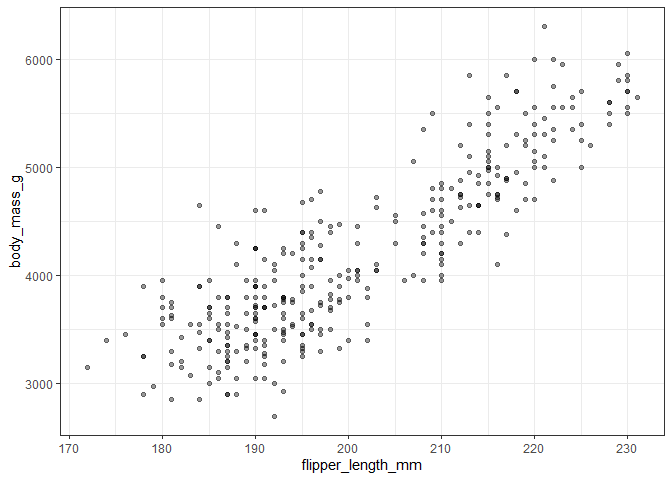
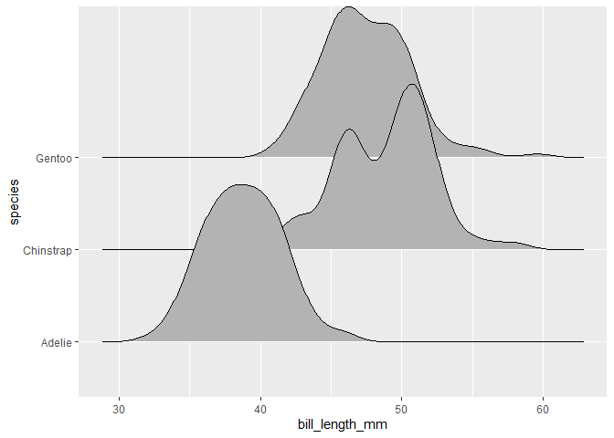

# Exercise 2: Explore two variables with dplyr and ggplot2

## Loading Packages

```r
library(ggplot2)
library(dplyr)
```

```
## 
## Attaching package: 'dplyr'
```

```
## The following objects are masked from 'package:stats':
## 
##     filter, lag
```

```
## The following objects are masked from 'package:base':
## 
##     intersect, setdiff, setequal, union
```

```r
library(palmerpenguins)
```

## 2.1 
Pick two quantitative variables to explore.
* Make a summary table of descriptive statistics for these variables using summarize(). Include whatever staistics you feel appropriate (mean, median sd, range, etc.).
* Make a scatterplot of these variables using ggplot().

### 2.1a)

```r
penguins %>% 
  summarize(mu_flipper_length = mean(flipper_length_mm, na.rm = TRUE),
            sigma_flipper_length = sd(flipper_length_mm, na.rm = TRUE),
            mu_body_mass = mean(body_mass_g, na.rm = TRUE),
            sigma_body_mass = sd(body_mass_g, na.rm = TRUE))
```

```
## # A tibble: 1 x 4
##   mu_flipper_length sigma_flipper_length mu_body_mass sigma_body_mass
##               <dbl>                <dbl>        <dbl>           <dbl>
## 1              201.                 14.1        4202.            802.
```

### 2.1b)

```r
penguins %>% 
  ggplot(aes(x=flipper_length_mm, y=body_mass_g)) +
  geom_point(alpha = .4) +
  theme_bw()
```

```
## Warning: Removed 2 rows containing missing values (geom_point).
```

<!-- -->

## 2.2

Pick one categorical variable and one quantitative variable to explore.

* Make a summary table giving the sample size (hint: n()) and descriptive statistics for the quantitative variable by group.

* Make one or more useful plots to visualize these variables.

### 2.2a)

```r
penguins %>% 
  group_by(species) %>% 
  summarize(mu_bill_length = mean(bill_length_mm, na.rm = TRUE),
            sigma_bill_length = sd(bill_length_mm, na.rm = TRUE),
            n = n())
```

```
## # A tibble: 3 x 4
##   species   mu_bill_length sigma_bill_length     n
## * <fct>              <dbl>             <dbl> <int>
## 1 Adelie              38.8              2.66   152
## 2 Chinstrap           48.8              3.34    68
## 3 Gentoo              47.5              3.08   124
```

### 2.2b) 

```r
penguins %>%  
  ggplot(aes(bill_length_mm, species)) +
  ggridges::geom_density_ridges()
```

```
## Picking joint bandwidth of 1.08
```

```
## Warning: Removed 2 rows containing non-finite values (stat_density_ridges).
```

<!-- -->


#Bonus Exercise: Recycling (Optional)
Evaluate this code and describe the result. The goal was to get the data for Rwanda and Afghanistan. Does this work? Why or why not? If not, what is the correct way to do this?

```r
filter(gapminder::gapminder, country == c("Rwanda", "Afghanistan"))
```

```
## # A tibble: 12 x 6
##    country     continent  year lifeExp      pop gdpPercap
##    <fct>       <fct>     <int>   <dbl>    <int>     <dbl>
##  1 Afghanistan Asia       1957    30.3  9240934      821.
##  2 Afghanistan Asia       1967    34.0 11537966      836.
##  3 Afghanistan Asia       1977    38.4 14880372      786.
##  4 Afghanistan Asia       1987    40.8 13867957      852.
##  5 Afghanistan Asia       1997    41.8 22227415      635.
##  6 Afghanistan Asia       2007    43.8 31889923      975.
##  7 Rwanda      Africa     1952    40    2534927      493.
##  8 Rwanda      Africa     1962    43    3051242      597.
##  9 Rwanda      Africa     1972    44.6  3992121      591.
## 10 Rwanda      Africa     1982    46.2  5507565      882.
## 11 Rwanda      Africa     1992    23.6  7290203      737.
## 12 Rwanda      Africa     2002    43.4  7852401      786.
```
It does not completely work. This code only returns the data for every *other* year per country. For example, it provides Afghanistan's data for 1957, but not for the years before (1952) or after (1962). R is comparing values equal to one country then the other, thereby "flip flopping" between the two. The correct way to do it is using the relational function ```%in%```
