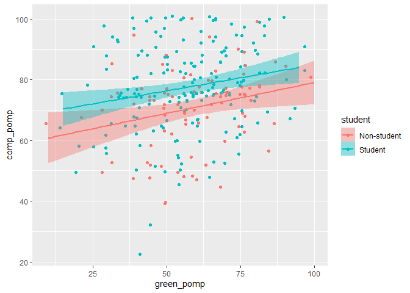
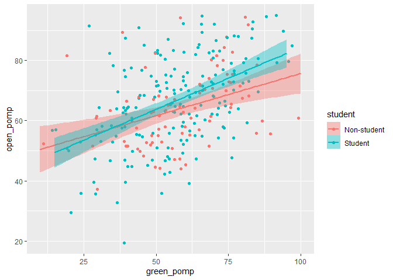

hw3
================
Ian Nel
2/22/2021

<!-- BMW: In your YAML header, indent subsections by 2 spaces, not 4.
          Sub-options, like the theme for html_document, need to be indented under the parent option. When you have a sub-option like theme, don't include "default" for the parent option. 
          See what I edited above.
-->

# Homework 03

You will analyze data looking at the relationship between **green
reputation** and three personality traits–**compassion**, **intellectual
curiosity**, and **openness to experiences**. The dataset includes data
from **students** and **non-students**.

``` r
dictionary <- readr::read_csv(here::here("hw_3", "green_dictionary.csv"))
```

    ## 
    ## -- Column specification --------------------------------------------------------
    ## cols(
    ##   Item = col_character(),
    ##   Content = col_character(),
    ##   Options = col_character(),
    ##   Keying = col_double()
    ## )

``` r
green_data <- readr::read_csv(here::here("hw_3", "green_data.csv"))
```

    ## 
    ## -- Column specification --------------------------------------------------------
    ## cols(
    ##   .default = col_double(),
    ##   id = col_character()
    ## )
    ## i Use `spec()` for the full column specifications.

For your assignment, do the following.

1.  Inspect the item responses (e.g., with graphs or by summarizing
    distinct values). Is anything unusual?
2.  Compute total scores for the four scales. Recode variables as
    needed.
3.  Rescale the variables so that they go from 0-100 instead of the
    original range. Name the recaled variables `*_pomp`.
4.  Make plots that illustrate the distributions of the 4 POMP-scored
    variables.
5.  Make scatterplots showing the relationships between **green
    reputation** and each personality trait. Include trend lines for
    **students** and **non-students**. What do these plots show?
6.  Compare **green reputation** for students and non-students using a
    **rainfall plot** (bar + density + data points).
7.  Compute a summary table of means, SDs, medians, minima, and maxima
    for the four total scores for students and non-students.

In your assignment, prepare an RMarkdown file that includes both the
coding and (for 4-7) narrative descriptions of your results.

## 1) Inspect the item responses (e.g., with graphs or by summarizing distinct values). Is anything unusual?

``` r
print(green_data) # BMW: Dont' print whole datasets in your final report
```

    ## # A tibble: 373 x 37
    ##    id    green1 green2 green3 green4 green5 comp1 comp2 comp3 comp4 comp5 comp6
    ##    <chr>  <dbl>  <dbl>  <dbl>  <dbl>  <dbl> <dbl> <dbl> <dbl> <dbl> <dbl> <dbl>
    ##  1 9099       4      2      5      4      3     2     5     4     4     2     2
    ##  2 6275       3      5      3      3      1     4     5     4     5     5     1
    ##  3 8116       4      2      5      4      3     4     5     5     4     5     1
    ##  4 8586       4      3      5      4      3     4     5     5     4     5     1
    ##  5 0406       3      2      4      4      4     4     4     4     4     4     2
    ##  6 5645       4      3      4      4      3     5     5     5     4     4     2
    ##  7 3788       1      1      1      1      1     3     3     3     3     3     3
    ##  8 8424       4      3      2      2      2     1     1     1     2     2     4
    ##  9 8450       4      2      3      5      2     4     4     4     4     4     1
    ## 10 0512       4      2      5      5      4     5     2     5     4     2     2
    ## # ... with 363 more rows, and 25 more variables: comp7 <dbl>, comp8 <dbl>,
    ## #   comp9 <dbl>, comp10 <dbl>, intel1 <dbl>, intel2 <dbl>, intel3 <dbl>,
    ## #   intel4 <dbl>, intel5 <dbl>, intel6 <dbl>, intel7 <dbl>, intel8 <dbl>,
    ## #   intel9 <dbl>, intel10 <dbl>, open1 <dbl>, open2 <dbl>, open3 <dbl>,
    ## #   open4 <dbl>, open5 <dbl>, open6 <dbl>, open7 <dbl>, open8 <dbl>,
    ## #   open9 <dbl>, open10 <dbl>, student <dbl>

``` r
summary(green_data) #some values are coded as -99, so I'm going to code them as
```

    ##       id                green1          green2         green3     
    ##  Length:373         Min.   :1.000   Min.   :1.00   Min.   :1.000  
    ##  Class :character   1st Qu.:3.000   1st Qu.:2.00   1st Qu.:3.000  
    ##  Mode  :character   Median :4.000   Median :3.00   Median :4.000  
    ##                     Mean   :3.476   Mean   :2.93   Mean   :3.797  
    ##                     3rd Qu.:4.000   3rd Qu.:4.00   3rd Qu.:4.000  
    ##                     Max.   :5.000   Max.   :5.00   Max.   :5.000  
    ##                     NA's   :58      NA's   :58     NA's   :58     
    ##      green4          green5          comp1             comp2        
    ##  Min.   :1.000   Min.   :1.000   Min.   :-99.000   Min.   :-99.000  
    ##  1st Qu.:3.000   1st Qu.:2.000   1st Qu.:  4.000   1st Qu.:  4.000  
    ##  Median :3.000   Median :3.000   Median :  4.000   Median :  4.000  
    ##  Mean   :3.238   Mean   :2.835   Mean   :  3.648   Mean   :  3.702  
    ##  3rd Qu.:4.000   3rd Qu.:4.000   3rd Qu.:  4.000   3rd Qu.:  4.500  
    ##  Max.   :5.000   Max.   :5.000   Max.   :  5.000   Max.   :  5.000  
    ##  NA's   :58      NA's   :58      NA's   :86        NA's   :78       
    ##      comp3           comp4             comp5             comp6      
    ##  Min.   :1.000   Min.   :-99.000   Min.   :-99.000   Min.   :1.000  
    ##  1st Qu.:4.000   1st Qu.:  4.000   1st Qu.:  4.000   1st Qu.:2.000  
    ##  Median :4.000   Median :  4.000   Median :  4.000   Median :2.000  
    ##  Mean   :4.267   Mean   :  3.691   Mean   :  3.319   Mean   :2.161  
    ##  3rd Qu.:5.000   3rd Qu.:  4.000   3rd Qu.:  4.000   3rd Qu.:3.000  
    ##  Max.   :5.000   Max.   :  5.000   Max.   :  5.000   Max.   :5.000  
    ##  NA's   :77      NA's   :85        NA's   :88        NA's   :81     
    ##      comp7            comp8             comp9             comp10       
    ##  Min.   :-99.00   Min.   :-99.000   Min.   :-99.000   Min.   :-99.000  
    ##  1st Qu.:  2.00   1st Qu.:  2.000   1st Qu.:  2.000   1st Qu.:  1.000  
    ##  Median :  2.00   Median :  2.000   Median :  2.000   Median :  2.000  
    ##  Mean   :  1.84   Mean   :  1.739   Mean   :  1.342   Mean   :  1.577  
    ##  3rd Qu.:  3.00   3rd Qu.:  2.000   3rd Qu.:  2.000   3rd Qu.:  2.000  
    ##  Max.   :  5.00   Max.   :  5.000   Max.   :  5.000   Max.   :  5.000  
    ##  NA's   :86       NA's   :90        NA's   :89        NA's   :89       
    ##      intel1           intel2            intel3            intel4       
    ##  Min.   :-99.00   Min.   :-99.000   Min.   :-99.000   Min.   :-99.000  
    ##  1st Qu.:  3.00   1st Qu.:  3.000   1st Qu.:  3.000   1st Qu.:  3.000  
    ##  Median :  4.00   Median :  4.000   Median :  4.000   Median :  4.000  
    ##  Mean   :  3.38   Mean   :  3.336   Mean   :  2.822   Mean   :  2.656  
    ##  3rd Qu.:  4.00   3rd Qu.:  4.000   3rd Qu.:  4.000   3rd Qu.:  4.000  
    ##  Max.   :  5.00   Max.   :  5.000   Max.   :  5.000   Max.   :  5.000  
    ##  NA's   :78       NA's   :90        NA's   :86        NA's   :88       
    ##      intel5            intel6            intel7            intel8       
    ##  Min.   :-99.000   Min.   :-99.000   Min.   :-99.000   Min.   :-99.000  
    ##  1st Qu.:  3.000   1st Qu.:  3.000   1st Qu.:  2.000   1st Qu.:  2.000  
    ##  Median :  4.000   Median :  4.000   Median :  2.000   Median :  2.000  
    ##  Mean   :  3.378   Mean   :  3.211   Mean   :  2.101   Mean   :  2.125  
    ##  3rd Qu.:  4.000   3rd Qu.:  4.000   3rd Qu.:  3.000   3rd Qu.:  3.000  
    ##  Max.   :  5.000   Max.   :  5.000   Max.   :  5.000   Max.   :  5.000  
    ##  NA's   :77        NA's   :89        NA's   :86        NA's   :78       
    ##      intel9           intel10            open1             open2        
    ##  Min.   :-99.000   Min.   :-99.000   Min.   :-99.000   Min.   :-99.000  
    ##  1st Qu.:  2.000   1st Qu.:  2.000   1st Qu.:  4.000   1st Qu.:  3.000  
    ##  Median :  2.000   Median :  2.000   Median :  4.000   Median :  4.000  
    ##  Mean   :  2.014   Mean   :  1.809   Mean   :  3.894   Mean   :  3.411  
    ##  3rd Qu.:  4.000   3rd Qu.:  3.000   3rd Qu.:  5.000   3rd Qu.:  4.000  
    ##  Max.   :  5.000   Max.   :  5.000   Max.   :  5.000   Max.   :  5.000  
    ##  NA's   :90        NA's   :90        NA's   :81        NA's   :81       
    ##      open3             open4             open5             open6        
    ##  Min.   :-99.000   Min.   :-99.000   Min.   :-99.000   Min.   :-99.000  
    ##  1st Qu.:  3.000   1st Qu.:  3.000   1st Qu.:  3.000   1st Qu.:  3.000  
    ##  Median :  4.000   Median :  4.000   Median :  4.000   Median :  4.000  
    ##  Mean   :  3.387   Mean   :  3.562   Mean   :  3.109   Mean   :  2.882  
    ##  3rd Qu.:  4.000   3rd Qu.:  5.000   3rd Qu.:  4.000   3rd Qu.:  4.000  
    ##  Max.   :  5.000   Max.   :  5.000   Max.   :  5.000   Max.   :  5.000  
    ##  NA's   :89        NA's   :85        NA's   :88        NA's   :84       
    ##      open7             open8           open9           open10      
    ##  Min.   :-99.000   Min.   :1.000   Min.   :1.000   Min.   :-99.00  
    ##  1st Qu.:  2.000   1st Qu.:2.000   1st Qu.:2.000   1st Qu.:  2.00  
    ##  Median :  3.000   Median :2.000   Median :2.000   Median :  2.00  
    ##  Mean   :  2.274   Mean   :2.599   Mean   :2.568   Mean   :  2.36  
    ##  3rd Qu.:  4.000   3rd Qu.:3.000   3rd Qu.:4.000   3rd Qu.:  4.00  
    ##  Max.   :  5.000   Max.   :5.000   Max.   :5.000   Max.   :  5.00  
    ##  NA's   :85        NA's   :84      NA's   :77      NA's   :90      
    ##     student       
    ##  Min.   :-99.000  
    ##  1st Qu.:  1.000  
    ##  Median :  2.000  
    ##  Mean   :  1.309  
    ##  3rd Qu.:  2.000  
    ##  Max.   :  2.000  
    ##  NA's   :95

``` r
dat <- green_data %>%
  mutate(student = factor(student, levels = c(1, 2), labels = c("Non-student", "Student"))) %>% # BMW: You can conversion to factor and setting labels in one line like this
  na_if("-99")

summary(dat) #now minimum values are 1 (not -99)
```

    ##       id                green1          green2         green3     
    ##  Length:373         Min.   :1.000   Min.   :1.00   Min.   :1.000  
    ##  Class :character   1st Qu.:3.000   1st Qu.:2.00   1st Qu.:3.000  
    ##  Mode  :character   Median :4.000   Median :3.00   Median :4.000  
    ##                     Mean   :3.476   Mean   :2.93   Mean   :3.797  
    ##                     3rd Qu.:4.000   3rd Qu.:4.00   3rd Qu.:4.000  
    ##                     Max.   :5.000   Max.   :5.00   Max.   :5.000  
    ##                     NA's   :58      NA's   :58     NA's   :58     
    ##      green4          green5          comp1           comp2      
    ##  Min.   :1.000   Min.   :1.000   Min.   :1.000   Min.   :1.000  
    ##  1st Qu.:3.000   1st Qu.:2.000   1st Qu.:4.000   1st Qu.:4.000  
    ##  Median :3.000   Median :3.000   Median :4.000   Median :4.000  
    ##  Mean   :3.238   Mean   :2.835   Mean   :4.007   Mean   :4.051  
    ##  3rd Qu.:4.000   3rd Qu.:4.000   3rd Qu.:4.000   3rd Qu.:4.750  
    ##  Max.   :5.000   Max.   :5.000   Max.   :5.000   Max.   :5.000  
    ##  NA's   :58      NA's   :58      NA's   :87      NA's   :79     
    ##      comp3           comp4           comp5           comp6      
    ##  Min.   :1.000   Min.   :1.000   Min.   :1.000   Min.   :1.000  
    ##  1st Qu.:4.000   1st Qu.:4.000   1st Qu.:4.000   1st Qu.:2.000  
    ##  Median :4.000   Median :4.000   Median :4.000   Median :2.000  
    ##  Mean   :4.267   Mean   :4.049   Mean   :4.042   Mean   :2.161  
    ##  3rd Qu.:5.000   3rd Qu.:4.000   3rd Qu.:4.000   3rd Qu.:3.000  
    ##  Max.   :5.000   Max.   :5.000   Max.   :5.000   Max.   :5.000  
    ##  NA's   :77      NA's   :86      NA's   :90      NA's   :81     
    ##      comp7           comp8           comp9           comp10     
    ##  Min.   :1.000   Min.   :1.000   Min.   :1.000   Min.   :1.000  
    ##  1st Qu.:2.000   1st Qu.:2.000   1st Qu.:2.000   1st Qu.:1.000  
    ##  Median :2.000   Median :2.000   Median :2.000   Median :2.000  
    ##  Mean   :2.192   Mean   :2.096   Mean   :2.053   Mean   :1.933  
    ##  3rd Qu.:3.000   3rd Qu.:2.000   3rd Qu.:2.000   3rd Qu.:2.000  
    ##  Max.   :5.000   Max.   :5.000   Max.   :5.000   Max.   :5.000  
    ##  NA's   :87      NA's   :91      NA's   :91      NA's   :90     
    ##      intel1          intel2          intel3          intel4     
    ##  Min.   :1.000   Min.   :1.000   Min.   :1.000   Min.   :1.000  
    ##  1st Qu.:3.000   1st Qu.:3.000   1st Qu.:3.000   1st Qu.:3.000  
    ##  Median :4.000   Median :4.000   Median :4.000   Median :4.000  
    ##  Mean   :3.728   Mean   :3.699   Mean   :3.537   Mean   :3.375  
    ##  3rd Qu.:4.000   3rd Qu.:4.000   3rd Qu.:4.000   3rd Qu.:4.000  
    ##  Max.   :5.000   Max.   :5.000   Max.   :5.000   Max.   :5.000  
    ##  NA's   :79      NA's   :91      NA's   :88      NA's   :90     
    ##      intel5          intel6          intel7          intel8     
    ##  Min.   :1.000   Min.   :1.000   Min.   :1.000   Min.   :1.000  
    ##  1st Qu.:3.000   1st Qu.:3.000   1st Qu.:2.000   1st Qu.:2.000  
    ##  Median :4.000   Median :4.000   Median :2.000   Median :2.000  
    ##  Mean   :3.725   Mean   :3.572   Mean   :2.455   Mean   :2.469  
    ##  3rd Qu.:4.000   3rd Qu.:4.000   3rd Qu.:3.000   3rd Qu.:3.000  
    ##  Max.   :5.000   Max.   :5.000   Max.   :5.000   Max.   :5.000  
    ##  NA's   :78      NA's   :90      NA's   :87      NA's   :79     
    ##      intel9         intel10          open1           open2      
    ##  Min.   :1.000   Min.   :1.000   Min.   :1.000   Min.   :1.000  
    ##  1st Qu.:2.000   1st Qu.:2.000   1st Qu.:4.000   1st Qu.:3.000  
    ##  Median :2.000   Median :2.000   Median :4.000   Median :4.000  
    ##  Mean   :2.733   Mean   :2.527   Mean   :4.247   Mean   :3.763  
    ##  3rd Qu.:4.000   3rd Qu.:3.000   3rd Qu.:5.000   3rd Qu.:4.000  
    ##  Max.   :5.000   Max.   :5.000   Max.   :5.000   Max.   :5.000  
    ##  NA's   :92      NA's   :92      NA's   :82      NA's   :82     
    ##      open3           open4          open5          open6           open7      
    ##  Min.   :1.000   Min.   :1.00   Min.   :1.00   Min.   :1.000   Min.   :1.000  
    ##  1st Qu.:3.000   1st Qu.:3.00   1st Qu.:3.00   1st Qu.:3.000   1st Qu.:2.000  
    ##  Median :4.000   Median :4.00   Median :4.00   Median :4.000   Median :3.000  
    ##  Mean   :3.749   Mean   :3.92   Mean   :3.83   Mean   :3.592   Mean   :2.983  
    ##  3rd Qu.:4.000   3rd Qu.:5.00   3rd Qu.:4.00   3rd Qu.:4.000   3rd Qu.:4.000  
    ##  Max.   :5.000   Max.   :5.00   Max.   :5.00   Max.   :5.000   Max.   :5.000  
    ##  NA's   :90      NA's   :86     NA's   :90     NA's   :86      NA's   :87     
    ##      open8           open9           open10            student   
    ##  Min.   :1.000   Min.   :1.000   Min.   :1.00   Non-student: 91  
    ##  1st Qu.:2.000   1st Qu.:2.000   1st Qu.:2.00   Student    :186  
    ##  Median :2.000   Median :2.000   Median :2.00   NA's       : 96  
    ##  Mean   :2.599   Mean   :2.568   Mean   :2.72                    
    ##  3rd Qu.:3.000   3rd Qu.:4.000   3rd Qu.:4.00                    
    ##  Max.   :5.000   Max.   :5.000   Max.   :5.00                    
    ##  NA's   :84      NA's   :77      NA's   :91

## 2) Compute total scores for the four scales. Recode variables as needed.

``` r
#see which variables need to be recoded
view(dictionary) # BMW: Don't leave `View()` calls in your final document. 

#Reverse code items
reversed <- dictionary %>% 
  filter(Keying == -1) %>% 
  pull(Item)

datr <- dat %>% 
  mutate(
    across(all_of(reversed),
           ~ 6 - .x,
           .names = "{.col}r")
  ) # BMW: Nicely done.

#Using rowwise function to create total scores for each person 

datr2 <- datr %>% 
  rowwise() %>% 
  mutate(
   green_tot = mean(c(green1,green2r,green3,green4,green5), na.rm = FALSE),
         comp_tot = mean(c(comp1,comp2,comp3,comp4,comp5,comp6r,comp7r,comp8r,comp9r,comp10r), na.rm = FALSE),
         intel_tot = mean(c(intel1,intel2,intel3,intel4,intel5,intel6,intel7r,intel8r,intel9r,intel10r), na.rm =FALSE),
         open_tot = mean(c(open1,open2,open3,open4,open5,open6,open7r,open8r,open9r,open10r), na.rm = FALSE)
   ) %>% 
  ungroup() # BMW: Always ungroup() after you use rowwise() or group_by()

summary(datr2)
```

    ##       id                green1          green2         green3     
    ##  Length:373         Min.   :1.000   Min.   :1.00   Min.   :1.000  
    ##  Class :character   1st Qu.:3.000   1st Qu.:2.00   1st Qu.:3.000  
    ##  Mode  :character   Median :4.000   Median :3.00   Median :4.000  
    ##                     Mean   :3.476   Mean   :2.93   Mean   :3.797  
    ##                     3rd Qu.:4.000   3rd Qu.:4.00   3rd Qu.:4.000  
    ##                     Max.   :5.000   Max.   :5.00   Max.   :5.000  
    ##                     NA's   :58      NA's   :58     NA's   :58     
    ##      green4          green5          comp1           comp2      
    ##  Min.   :1.000   Min.   :1.000   Min.   :1.000   Min.   :1.000  
    ##  1st Qu.:3.000   1st Qu.:2.000   1st Qu.:4.000   1st Qu.:4.000  
    ##  Median :3.000   Median :3.000   Median :4.000   Median :4.000  
    ##  Mean   :3.238   Mean   :2.835   Mean   :4.007   Mean   :4.051  
    ##  3rd Qu.:4.000   3rd Qu.:4.000   3rd Qu.:4.000   3rd Qu.:4.750  
    ##  Max.   :5.000   Max.   :5.000   Max.   :5.000   Max.   :5.000  
    ##  NA's   :58      NA's   :58      NA's   :87      NA's   :79     
    ##      comp3           comp4           comp5           comp6      
    ##  Min.   :1.000   Min.   :1.000   Min.   :1.000   Min.   :1.000  
    ##  1st Qu.:4.000   1st Qu.:4.000   1st Qu.:4.000   1st Qu.:2.000  
    ##  Median :4.000   Median :4.000   Median :4.000   Median :2.000  
    ##  Mean   :4.267   Mean   :4.049   Mean   :4.042   Mean   :2.161  
    ##  3rd Qu.:5.000   3rd Qu.:4.000   3rd Qu.:4.000   3rd Qu.:3.000  
    ##  Max.   :5.000   Max.   :5.000   Max.   :5.000   Max.   :5.000  
    ##  NA's   :77      NA's   :86      NA's   :90      NA's   :81     
    ##      comp7           comp8           comp9           comp10     
    ##  Min.   :1.000   Min.   :1.000   Min.   :1.000   Min.   :1.000  
    ##  1st Qu.:2.000   1st Qu.:2.000   1st Qu.:2.000   1st Qu.:1.000  
    ##  Median :2.000   Median :2.000   Median :2.000   Median :2.000  
    ##  Mean   :2.192   Mean   :2.096   Mean   :2.053   Mean   :1.933  
    ##  3rd Qu.:3.000   3rd Qu.:2.000   3rd Qu.:2.000   3rd Qu.:2.000  
    ##  Max.   :5.000   Max.   :5.000   Max.   :5.000   Max.   :5.000  
    ##  NA's   :87      NA's   :91      NA's   :91      NA's   :90     
    ##      intel1          intel2          intel3          intel4     
    ##  Min.   :1.000   Min.   :1.000   Min.   :1.000   Min.   :1.000  
    ##  1st Qu.:3.000   1st Qu.:3.000   1st Qu.:3.000   1st Qu.:3.000  
    ##  Median :4.000   Median :4.000   Median :4.000   Median :4.000  
    ##  Mean   :3.728   Mean   :3.699   Mean   :3.537   Mean   :3.375  
    ##  3rd Qu.:4.000   3rd Qu.:4.000   3rd Qu.:4.000   3rd Qu.:4.000  
    ##  Max.   :5.000   Max.   :5.000   Max.   :5.000   Max.   :5.000  
    ##  NA's   :79      NA's   :91      NA's   :88      NA's   :90     
    ##      intel5          intel6          intel7          intel8     
    ##  Min.   :1.000   Min.   :1.000   Min.   :1.000   Min.   :1.000  
    ##  1st Qu.:3.000   1st Qu.:3.000   1st Qu.:2.000   1st Qu.:2.000  
    ##  Median :4.000   Median :4.000   Median :2.000   Median :2.000  
    ##  Mean   :3.725   Mean   :3.572   Mean   :2.455   Mean   :2.469  
    ##  3rd Qu.:4.000   3rd Qu.:4.000   3rd Qu.:3.000   3rd Qu.:3.000  
    ##  Max.   :5.000   Max.   :5.000   Max.   :5.000   Max.   :5.000  
    ##  NA's   :78      NA's   :90      NA's   :87      NA's   :79     
    ##      intel9         intel10          open1           open2      
    ##  Min.   :1.000   Min.   :1.000   Min.   :1.000   Min.   :1.000  
    ##  1st Qu.:2.000   1st Qu.:2.000   1st Qu.:4.000   1st Qu.:3.000  
    ##  Median :2.000   Median :2.000   Median :4.000   Median :4.000  
    ##  Mean   :2.733   Mean   :2.527   Mean   :4.247   Mean   :3.763  
    ##  3rd Qu.:4.000   3rd Qu.:3.000   3rd Qu.:5.000   3rd Qu.:4.000  
    ##  Max.   :5.000   Max.   :5.000   Max.   :5.000   Max.   :5.000  
    ##  NA's   :92      NA's   :92      NA's   :82      NA's   :82     
    ##      open3           open4          open5          open6           open7      
    ##  Min.   :1.000   Min.   :1.00   Min.   :1.00   Min.   :1.000   Min.   :1.000  
    ##  1st Qu.:3.000   1st Qu.:3.00   1st Qu.:3.00   1st Qu.:3.000   1st Qu.:2.000  
    ##  Median :4.000   Median :4.00   Median :4.00   Median :4.000   Median :3.000  
    ##  Mean   :3.749   Mean   :3.92   Mean   :3.83   Mean   :3.592   Mean   :2.983  
    ##  3rd Qu.:4.000   3rd Qu.:5.00   3rd Qu.:4.00   3rd Qu.:4.000   3rd Qu.:4.000  
    ##  Max.   :5.000   Max.   :5.00   Max.   :5.00   Max.   :5.000   Max.   :5.000  
    ##  NA's   :90      NA's   :86     NA's   :90     NA's   :86      NA's   :87     
    ##      open8           open9           open10            student   
    ##  Min.   :1.000   Min.   :1.000   Min.   :1.00   Non-student: 91  
    ##  1st Qu.:2.000   1st Qu.:2.000   1st Qu.:2.00   Student    :186  
    ##  Median :2.000   Median :2.000   Median :2.00   NA's       : 96  
    ##  Mean   :2.599   Mean   :2.568   Mean   :2.72                    
    ##  3rd Qu.:3.000   3rd Qu.:4.000   3rd Qu.:4.00                    
    ##  Max.   :5.000   Max.   :5.000   Max.   :5.00                    
    ##  NA's   :84      NA's   :77      NA's   :91                      
    ##     green2r         comp6r          comp7r          comp8r          comp9r     
    ##  Min.   :1.00   Min.   :1.000   Min.   :1.000   Min.   :1.000   Min.   :1.000  
    ##  1st Qu.:2.00   1st Qu.:3.000   1st Qu.:3.000   1st Qu.:4.000   1st Qu.:4.000  
    ##  Median :3.00   Median :4.000   Median :4.000   Median :4.000   Median :4.000  
    ##  Mean   :3.07   Mean   :3.839   Mean   :3.808   Mean   :3.904   Mean   :3.947  
    ##  3rd Qu.:4.00   3rd Qu.:4.000   3rd Qu.:4.000   3rd Qu.:4.000   3rd Qu.:4.000  
    ##  Max.   :5.00   Max.   :5.000   Max.   :5.000   Max.   :5.000   Max.   :5.000  
    ##  NA's   :58     NA's   :81      NA's   :87      NA's   :91      NA's   :91     
    ##     comp10r         intel7r         intel8r         intel9r     
    ##  Min.   :1.000   Min.   :1.000   Min.   :1.000   Min.   :1.000  
    ##  1st Qu.:4.000   1st Qu.:3.000   1st Qu.:3.000   1st Qu.:2.000  
    ##  Median :4.000   Median :4.000   Median :4.000   Median :4.000  
    ##  Mean   :4.067   Mean   :3.545   Mean   :3.531   Mean   :3.267  
    ##  3rd Qu.:5.000   3rd Qu.:4.000   3rd Qu.:4.000   3rd Qu.:4.000  
    ##  Max.   :5.000   Max.   :5.000   Max.   :5.000   Max.   :5.000  
    ##  NA's   :90      NA's   :87      NA's   :79      NA's   :92     
    ##     intel10r         open7r          open8r          open9r         open10r    
    ##  Min.   :1.000   Min.   :1.000   Min.   :1.000   Min.   :1.000   Min.   :1.00  
    ##  1st Qu.:3.000   1st Qu.:2.000   1st Qu.:3.000   1st Qu.:2.000   1st Qu.:2.00  
    ##  Median :4.000   Median :3.000   Median :4.000   Median :4.000   Median :4.00  
    ##  Mean   :3.473   Mean   :3.017   Mean   :3.401   Mean   :3.432   Mean   :3.28  
    ##  3rd Qu.:4.000   3rd Qu.:4.000   3rd Qu.:4.000   3rd Qu.:4.000   3rd Qu.:4.00  
    ##  Max.   :5.000   Max.   :5.000   Max.   :5.000   Max.   :5.000   Max.   :5.00  
    ##  NA's   :92      NA's   :87      NA's   :84      NA's   :77      NA's   :91    
    ##    green_tot        comp_tot       intel_tot        open_tot    
    ##  Min.   :1.400   Min.   :1.900   Min.   :2.000   Min.   :1.800  
    ##  1st Qu.:2.800   1st Qu.:3.700   1st Qu.:3.200   1st Qu.:3.200  
    ##  Median :3.200   Median :4.000   Median :3.600   Median :3.600  
    ##  Mean   :3.283   Mean   :4.004   Mean   :3.546   Mean   :3.624  
    ##  3rd Qu.:3.800   3rd Qu.:4.400   3rd Qu.:4.000   3rd Qu.:4.000  
    ##  Max.   :5.000   Max.   :5.000   Max.   :4.900   Max.   :4.800  
    ##  NA's   :58      NA's   :94      NA's   :97      NA's   :96

## 3) Rescale the variables so that they go from 0-100 instead of the original range. Name the recaled variables `*_pomp`.

``` r
#Using rowwise function to rescale scores for each person from a 1-5 to a 0-100 scale. 
datr3 <- datr2 %>% 
  rowwise() %>% 
  mutate(green_pomp = rescale(green_tot, to = c(0, 100), from = c(1,5)),
         comp_pomp = rescale(comp_tot, to = c(0, 100), from = c(1,5)),
         intel_pomp = rescale(intel_tot, to = c(0, 100), from = c(1,5)),
         open_pomp = rescale(open_tot, to = c(0, 100), from = c(1,5))
  ) %>% 
  ungroup()

# BMW: In general, use more descriptive object names. eg, dat_cleaned or dat_analysis instead of datr3
```

## 4) Make plots that illustrate the distributions of the 4 POMP-scored variables.

``` r
green_hist <- ggplot(datr3) +
  aes(x = green_pomp, y = ..density..) +
  geom_histogram(color="springgreen",fill="dark green", binwidth = 5)+
  geom_density(alpha = .1, fill = "black")

comp_hist <- ggplot(datr3) +
  aes(x = comp_pomp, y = ..density..) +
  geom_histogram(color = "midnightblue", fill="pink", binwidth = 5)+
  geom_density(alpha = .1, fill = "black")

intel_hist <- ggplot(datr3) +
  aes(x = intel_pomp, y = ..density..) +
  geom_histogram(color = "darkorchid2", fill="gold", binwidth = 5) +
  geom_density(alpha = .1, fill = "black")

open_hist <- ggplot(datr3) +
  aes(x = open_pomp, y = ..density..) +
  geom_histogram(color="black", fill="turquoise2", binwidth = 5) +
  geom_density(alpha = .1, fill = "black")

gridExtra::grid.arrange(green_hist,comp_hist,intel_hist,open_hist)
```

    ## Warning: Removed 58 rows containing non-finite values (stat_bin).

    ## Warning: Removed 58 rows containing non-finite values (stat_density).

    ## Warning: Removed 94 rows containing non-finite values (stat_bin).

    ## Warning: Removed 94 rows containing non-finite values (stat_density).

    ## Warning: Removed 97 rows containing non-finite values (stat_bin).

    ## Warning: Removed 97 rows containing non-finite values (stat_density).

    ## Warning: Removed 96 rows containing non-finite values (stat_bin).

    ## Warning: Removed 96 rows containing non-finite values (stat_density).

<!-- --> \#\#\#
Narrative Description These histograms demonstrate that these variables
have a relatively normal distribution, except for “comp\_pomp” which is
skewed to the left. “Intel\_pomp” also appears to be somewhat bimodal.

## 5) Make scatterplots showing the relationships between **green reputation** and each personality trait. Include trend lines for **students** and **non-students**. What do these plots show?

``` r
datr3 %>% 
  filter(!is.na(student)) %>% 
  ggplot() +
  aes(y = comp_pomp,
      x = green_pomp,
      group = student,
      color = student,
      fill = student) +
  geom_jitter() +
  geom_smooth(method = "lm")
```

    ## `geom_smooth()` using formula 'y ~ x'

    ## Warning: Removed 4 rows containing non-finite values (stat_smooth).

    ## Warning: Removed 4 rows containing missing values (geom_point).

<!-- -->

``` r
datr3 %>% 
  filter(!is.na(student)) %>% 
  ggplot() +
  aes(y = intel_pomp,
      x = green_pomp,
      group = student,
      color = student,
      fill = student) +
  geom_jitter() +
  geom_smooth(method = "lm")
```

    ## `geom_smooth()` using formula 'y ~ x'

    ## Warning: Removed 7 rows containing non-finite values (stat_smooth).

    ## Warning: Removed 7 rows containing missing values (geom_point).

<!-- -->

``` r
datr3 %>% 
  filter(!is.na(student)) %>% 
  ggplot() +
  aes(y = open_pomp,
      x = green_pomp,
      group = student,
      color = student,
      fill = student) +
  geom_jitter() +
  geom_smooth(method = "lm")
```

    ## `geom_smooth()` using formula 'y ~ x'

    ## Warning: Removed 6 rows containing non-finite values (stat_smooth).

    ## Warning: Removed 6 rows containing missing values (geom_point).

<!-- --> \#\#\#
Narrative Description There is a small positive correlation between
green\_pomp and all three personality traits. The strength and magnitude
of these correlations are similar for both students and nonstudents, but
the relationship between green\_pomp and comp\_pop is slightly greater
for students than non-students.

## 6) Compare **green reputation** for students and non-students using a **rainfall plot** (bar + density + data points).

``` r
datr3 %>% 
  filter(!is.na(student)) %>% 
ggplot() +
  aes(y = student,
      x = green_pomp,
      fill = student,
      color = student) +
  geom_boxplot(color = "black",
               alpha = .5,
               width = .5,
               size = .5) +
  ggdist::stat_slab(height = .5,
                    color = "black",
                    size = .5,
                    alpha = .5,
                    position = position_nudge(y = .1))
```

<!-- --> \#\#\#
Narrative Description This rainfall plot shows that the median
green\_pomp for non-students is slightly larger for non-students than
for students. The green\_pomp distribution for non-students appears to
be more bimodal, whereas the distribution for students appears to be
normal.

## 7) Compute a summary table of means, SDs, medians, minima, and maxima for the four total scores for students and non-students.

``` r
sumtable <- datr3 %>% 
  na.omit() %>% 
  group_by(student) %>% 
  summarize(across(c(green_pomp,open_pomp,intel_pomp,comp_pomp),
                   list(Mean = ~ mean(.x, na.rm = TRUE),
                        SD = ~ sd(.x, na.rm = TRUE),
                        Median = ~ median(.x, na.rm = TRUE),
                        Min = ~ min(.x, na.rm = TRUE),
                        Max = ~ max(.x, na.rm = TRUE)))
  )
kable(sumtable)
```

<table>
<thead>
<tr>
<th style="text-align:left;">
student
</th>
<th style="text-align:right;">
green\_pomp\_Mean
</th>
<th style="text-align:right;">
green\_pomp\_SD
</th>
<th style="text-align:right;">
green\_pomp\_Median
</th>
<th style="text-align:right;">
green\_pomp\_Min
</th>
<th style="text-align:right;">
green\_pomp\_Max
</th>
<th style="text-align:right;">
open\_pomp\_Mean
</th>
<th style="text-align:right;">
open\_pomp\_SD
</th>
<th style="text-align:right;">
open\_pomp\_Median
</th>
<th style="text-align:right;">
open\_pomp\_Min
</th>
<th style="text-align:right;">
open\_pomp\_Max
</th>
<th style="text-align:right;">
intel\_pomp\_Mean
</th>
<th style="text-align:right;">
intel\_pomp\_SD
</th>
<th style="text-align:right;">
intel\_pomp\_Median
</th>
<th style="text-align:right;">
intel\_pomp\_Min
</th>
<th style="text-align:right;">
intel\_pomp\_Max
</th>
<th style="text-align:right;">
comp\_pomp\_Mean
</th>
<th style="text-align:right;">
comp\_pomp\_SD
</th>
<th style="text-align:right;">
comp\_pomp\_Median
</th>
<th style="text-align:right;">
comp\_pomp\_Min
</th>
<th style="text-align:right;">
comp\_pomp\_Max
</th>
</tr>
</thead>
<tbody>
<tr>
<td style="text-align:left;">
Non-student
</td>
<td style="text-align:right;">
58.35294
</td>
<td style="text-align:right;">
16.73299
</td>
<td style="text-align:right;">
60
</td>
<td style="text-align:right;">
10
</td>
<td style="text-align:right;">
100
</td>
<td style="text-align:right;">
64.05882
</td>
<td style="text-align:right;">
12.64191
</td>
<td style="text-align:right;">
62.5
</td>
<td style="text-align:right;">
37.5
</td>
<td style="text-align:right;">
95
</td>
<td style="text-align:right;">
65.00000
</td>
<td style="text-align:right;">
13.97276
</td>
<td style="text-align:right;">
67.5
</td>
<td style="text-align:right;">
37.5
</td>
<td style="text-align:right;">
95.0
</td>
<td style="text-align:right;">
70.91176
</td>
<td style="text-align:right;">
13.33992
</td>
<td style="text-align:right;">
75.0
</td>
<td style="text-align:right;">
40.0
</td>
<td style="text-align:right;">
100
</td>
</tr>
<tr>
<td style="text-align:left;">
Student
</td>
<td style="text-align:right;">
56.62921
</td>
<td style="text-align:right;">
17.14470
</td>
<td style="text-align:right;">
55
</td>
<td style="text-align:right;">
15
</td>
<td style="text-align:right;">
95
</td>
<td style="text-align:right;">
66.74157
</td>
<td style="text-align:right;">
14.93349
</td>
<td style="text-align:right;">
67.5
</td>
<td style="text-align:right;">
20.0
</td>
<td style="text-align:right;">
95
</td>
<td style="text-align:right;">
63.03371
</td>
<td style="text-align:right;">
14.41648
</td>
<td style="text-align:right;">
65.0
</td>
<td style="text-align:right;">
25.0
</td>
<td style="text-align:right;">
97.5
</td>
<td style="text-align:right;">
77.80899
</td>
<td style="text-align:right;">
14.22588
</td>
<td style="text-align:right;">
77.5
</td>
<td style="text-align:right;">
22.5
</td>
<td style="text-align:right;">
100
</td>
</tr>
</tbody>
</table>

Non-students had a greater mean and median green reputation and
intellectual curiosity compared with students, whereas students had a
higher mean and median openness to experience and compassion.
